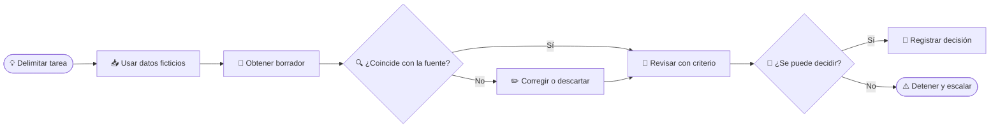

# Cuaderno del participante — Módulo 1: Fundamentos de IA y criterio profesional

_Versión base para estudiantes y profesionales con conocimientos contables iniciales · pendiente de adaptación a la matrícula._

## 🎯 Objetivos de esta sesión

Al terminar, podrás distinguir soluciones que automatizan reglas, analizan patrones o generan contenido; decidir en qué tareas contables la IA puede ayudar sin sustituir tu criterio; y revisar una salida separando **hechos**, **inferencias** e **información faltante**.

> **Regla de práctica:** todos los datos de este cuaderno son ficticios. No escribas aquí ni en el laboratorio nombres, cuentas, identificadores, recibos, saldos o documentos de clientes o empleados.

## 📖 Ideas clave

### Tres conceptos para empezar

| Concepto | En palabras sencillas | Ejemplo de uso en una práctica | Límite que debes recordar |
| --- | --- | --- | --- |
| Automatización por reglas | Sigue pasos definidos de antemano. | Marcar para revisión una fila cuyo importe supera un límite acordado. | Ejecutar una regla no decide si la regla es correcta para el caso. |
| IA analítica o predictiva | Busca patrones y puede estimar o priorizar con base en datos. | Ordenar movimientos por semejanza para que una persona revise coincidencias. | Una puntuación o alerta no explica por sí sola la causa. |
| IA generativa | Produce una respuesta, resumen o borrador a partir de una instrucción y contexto. | Redactar una explicación inicial usando una tabla ficticia. | Puede inventar un dato o una referencia y expresarlo con seguridad; hay que verificarlo.[^1] |

Estas categorías son una introducción: una aplicación puede combinar más de un tipo. En la contabilidad, IFAC reúne recursos sobre usos de IA y también sobre riesgos y gobernanza; el criterio del profesional sigue siendo parte del diseño de uso.[^2]

### Hecho, inferencia y desconocido

- **Hecho:** aparece en la información de origen y puede localizarse. Ejemplo: “El extracto ficticio muestra $3,500 en la referencia RC-01”.
- **Inferencia:** explicación posible, que todavía requiere evidencia. Ejemplo: “Quizá sea el cobro de un cliente”.
- **Desconocido:** dato ausente que no se debe completar inventándolo. Ejemplo: nombre del cliente, número de factura o motivo de una variación.

Una respuesta fluida no prueba que sea correcta. NIST describe el riesgo de que un sistema generativo presente contenido falso o citas aparentes; contrasta cada afirmación con la fuente, incluso si la explicación suena lógica.[^1]

### Ciclo de revisión humana

El diagrama es una guía para el ejercicio, no un procedimiento oficial de la organización.

## 🗂️ Actividad 1 — ¿Qué puede hacer la herramienta?

Clasifica cada tarjeta en una categoría y anota por qué:

- **A. Puede apoyar:** tarea preparatoria de bajo impacto; una persona revisa el resultado antes de usarlo.
- **B. Apoyo con verificación profesional obligatoria:** la salida puede afectar registros, reportes o interpretaciones.
- **C. No delegar decisión ni ejecución:** requiere autoridad, autorización, evidencia suficiente o tratamiento sensible.

| N.º | Situación | Categoría | Razón o control necesario |
| ---: | --- | --- | --- |
| 1 | Resumir una política contable pública en una página y señalar las secciones citadas. | | |
| 2 | Sugerir posibles categorías para movimientos de un conjunto ficticio. | | |
| 3 | Comparar dos listados sintéticos y marcar coincidencias aproximadas. | | |
| 4 | Aprobar automáticamente un pago a proveedor. | | |
| 5 | Proponer un borrador de comentario para una variación suministrada. | | |
| 6 | Determinar por sí sola si una persona puede tributar en un régimen. | | |
| 7 | Enviar un recibo real de nómina a un asistente público sin autorización. | | |
| 8 | Señalar una variación inusual para que se investigue. | | |
| 9 | Concluir fraude únicamente porque cambió un saldo. | | |
| 10 | Presentar una declaración oficial sin revisión y autorización humana. | | |

## 🧾 Actividad 2 — Caso ficticio “Taller Nopal”

**Contexto:** ejercicio educativo con cifras inventadas en MXN. La tabla no contiene nombres de clientes, proveedores, cuentas bancarias, CFDI ni datos fiscales.

| Fecha del caso | Referencia inventada | Descripción recibida | Importe o comparación |
| --- | --- | --- | ---: |
| 03-sep-2026 | RC-01 | Transferencia recibida | $3,500 |
| 04-sep-2026 | CB-03 | Cargo por servicio bancario | -$87 |
| 05-sep-2026 | G-11 | Compra descrita como papelería | -$620 |
| 06-sep-2026 | SUS-09 | Suscripción de software del periodo actual | $12,600 |
| Periodo anterior | SUS-09 | Referencia comparable anotada en el caso | $4,200 |

Lee esta salida hipotética y marca cada frase como **apoyada**, **no comprobada** o **incorrecta/conclusiva**:

> 1. RC-01 es un cobro del cliente “Nube Azul” asociado a la factura INV-281. 2. CB-03 fue pagado a “Banco Ejecutivo” por una licencia de software. 3. La compra G-11 por $620 es deducible para ISR. 4. La suscripción pasó de $4,200 a $12,600, por lo que hubo fraude.

| Afirmación | Estado | ¿Qué dato la respalda o qué falta? | Próximo paso seguro |
| --- | --- | --- | --- |
| Cliente “Nube Azul” y factura INV-281 | | | |
| Cargo a “Banco Ejecutivo” por software | | | |
| Tratamiento de ISR de G-11 | | | |
| Variación de SUS-09 y conclusión de fraude | | | |

Antes de responder, pregúntate: **¿está literalmente en la fuente? ¿es una explicación posible o una conclusión? ¿qué evidencia habría que consultar? ¿quién tiene autoridad para aprobar la decisión?**

## 🛡️ Lista breve de control

1. **Delimita:** ¿qué pregunta concreta puede ayudar a preparar?
2. **Protege:** ¿la información es ficticia o está permitida expresamente para ese entorno?
3. **Contrasta:** ¿cada importe, fecha, fuente y cita coincide con el documento de origen?
4. **Decide:** ¿una persona responsable revisa y registra la decisión? Si falta evidencia, detén o escala.

El enfoque centrado en las personas y el juicio crítico forma parte del marco educativo de UNESCO; en esta sesión se traduce en verificar y conservar la responsabilidad profesional.[^3]

## 📝 Ticket de salida

Responde en una frase cada pregunta:

1. ¿Qué diferencia práctica existe entre automatizar una regla y generar una explicación?
2. ¿Qué afirmación del caso parecía confiable, pero no estaba respaldada?
3. ¿Qué harías antes de usar una salida de IA en una tarea contable real?

## 🏠 Práctica independiente — 60 minutos

Elige una tarea contable **genérica**, no un caso real:

- **20 min:** descríbela sin datos personales y clasifícala como apoyo de bajo impacto, apoyo con verificación o decisión no delegable.
- **20 min:** identifica un hecho de origen, una posible inferencia y un dato que todavía no conoces.
- **20 min:** redacta una instrucción breve para obtener un borrador que separe hechos, supuestos e información faltante; añade cómo verificarías el resultado.

Si usas el [Laboratorio ContaIA](https://8328-i143dgisqzurgn5srq8gm-85c68042.us3.manus.computer/), limita la práctica a la actividad 1. No introduzcas información real. El laboratorio no conserva respuestas ni se conecta a un modelo externo.

## 📚 Glosario y fuentes

| Término | Definición para este módulo |
| --- | --- |
| IA | Familia amplia de sistemas que realizan tareas asociadas con percepción, análisis, predicción o generación; no significa que todas las herramientas funcionen igual. |
| IA generativa | Sistema que crea texto u otros contenidos de acuerdo con una instrucción y el contexto disponible. |
| Confabulación | Salida incorrecta o falsa presentada con seguridad; puede incluir citas o razonamientos aparentes. NIST también recoge “hallucination” y “fabrication” como términos comunes.[^1] |
| Supervisión humana | Revisión y decisión por una persona responsable, con facultad para corregir, detener o escalar. |
| Evidencia | Documento o dato verificable que respalda una afirmación del ejercicio. |

[^1]: Autio, C., et al. NIST. *Artificial Intelligence Risk Management Framework: Generative Artificial Intelligence Profile* (2024), sección 2.2 “Confabulation”. https://doi.org/10.6028/NIST.AI.600-1
[^2]: IFAC. *Artificial Intelligence & Accounting*. https://www.ifac.org/knowledge-gateway/discussion/artificial-intelligence-accounting
[^3]: UNESCO. *AI competency framework for students* (2024; página actualizada en 2026). https://www.unesco.org/en/articles/ai-competency-framework-students
