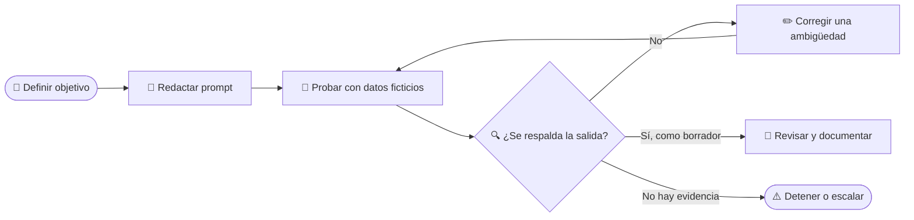

# Cuaderno del participante — Módulo 2: Diseño de instrucciones contables

_Versión base · 4 horas totales · diseñada para conocimientos contables iniciales · pendiente de adaptación a la matrícula._

---

## 🎯 Objetivos de aprendizaje

Al terminar podrás redactar y mejorar un prompt contable que especifique **rol, contexto, tarea, datos, formato y verificación/límites**; probarlo con un caso ficticio; y reconocer qué afirmaciones requieren una comprobación independiente.

> **Regla de práctica:** usa únicamente los movimientos inventados de este cuaderno. No escribas nombres, cuentas, identificadores, recibos, saldos o documentos de clientes o empleados.

## 📖 Ideas clave

### ¿Qué es un prompt?

Un prompt o instrucción describe una tarea que se solicita a un sistema generativo y puede incluir contexto, datos y requisitos de salida. Una instrucción clara ayuda a delimitar y evaluar la tarea, pero no garantiza que la respuesta sea verdadera. Las guías de proveedores recomiendan especificidad, contexto, formatos y ejemplos; algunas técnicas particulares pueden variar por producto.[^1][^2]

NIST denomina **confabulación** a la generación de contenido erróneo o falso que se presenta con seguridad; también puede incluir razonamientos o citas que parecen respaldar una respuesta, pero no lo hacen.[^3] Por eso, la regla contable es: **cada importe, referencia, comparación y cita debe volver a una fuente comprobable**.

### Seis elementos para revisar

| Elemento | Pregunta que responde | Ejemplo para esta práctica |
| --- | --- | --- |
| **Rol** | ¿Qué perspectiva de trabajo se solicita? | “Actúa como auxiliar de revisión contable” — no significa que el sistema tenga licencia o autoridad. |
| **Contexto** | ¿Cuál es el escenario y propósito? | “Caso educativo de una microempresa ficticia; preparar una comparación inicial”. |
| **Tarea** | ¿Qué acción concreta se pide? | “Compara los movimientos del banco con los del libro auxiliar”. |
| **Datos** | ¿Qué información está permitida? | “Usa solo las tablas ficticias incluidas; no completes datos ausentes”. |
| **Formato** | ¿Cómo debe organizarse la respuesta? | “Tabla con referencia, importe, estado y verificación siguiente”. |
| **Verificación y límites** | ¿Qué hacer ante faltantes o incertidumbre? | “Separa coincidencias de diferencias; marca lo no comprobable; no registres asientos”. |

No es necesario llenar siempre cada bloque con muchas palabras. Elige lo que reduzca una ambigüedad importante. El rol es opcional; no otorga competencia, acceso ni responsabilidad legal.

### Ciclo de iteración

*El flujo muestra una práctica de revisión: definir la tarea, probar una versión, comprobarla con los datos y corregir o detenerse si la evidencia no basta.*



En una iteración, cambia una dimensión relevante a la vez cuando sea posible y registra la diferencia. Una sola respuesta no basta para afirmar que el prompt siempre funcionará; el resultado puede variar entre ejecuciones o modelos.[^1][^2]

## 🧾 Caso ficticio: conciliación de septiembre

El propósito es detectar coincidencias y diferencias **para revisión**. No se debe crear un asiento ni determinar impuestos. Todas las fechas, importes y referencias de este ejemplo son inventados.

### Extracto bancario ficticio

| Referencia | Fecha | Descripción | Importe (MXN) |
| --- | --- | --- | ---: |
| BK-01 | 02-sep-2026 | Depósito RC-01 | +3,500 |
| BK-02 | 03-sep-2026 | Abono AR-204 | +2,450 |
| BK-03 | 04-sep-2026 | Comisión de servicio bancario | −87 |
| BK-04 | 05-sep-2026 | Papelería | −620 |
| BK-05 | 06-sep-2026 | Servicio digital | −420 |

### Libro auxiliar ficticio

| Referencia | Fecha | Descripción | Importe (MXN) |
| --- | --- | --- | ---: |
| LB-01 | 02-sep-2026 | Depósito RC-01 | +3,500 |
| LB-02 | 03-sep-2026 | Abono AR-204 | +2,450 |
| LB-03 | 05-sep-2026 | Papelería | −620 |
| LB-04 | 06-sep-2026 | Servicio digital | −420 |

### Actividad 1 — Detecta lo que falta en una instrucción

Lee el prompt inicial:

> “Revisa la conciliación y dime si todo está bien.”

Anota qué falta y por qué importa:

| Pregunta | Nota |
| --- | --- |
| ¿Qué documentos o datos debe comparar? | |
| ¿Qué significa “bien” para esta tarea? | |
| ¿Qué formato facilitaría la revisión? | |
| ¿Qué debe ocurrir si hay una diferencia? | |
| ¿Qué acción no debe ejecutar el modelo? | |
| ¿Qué dato no se le debe inventar? | |

### Actividad 2 — Escribe una versión delimitada

Completa el borrador de abajo. Puedes consultar [Plantillas de prompts](plantillas-prompts.md).

```text
ROL (opcional):

CONTEXTO:

TAREA concreta:

DATOS permitidos:

FORMATO de salida:

VERIFICACIÓN, límites y condición para detenerse:
```

Incluye únicamente las dos tablas del caso como datos. No agregues supuestos sobre el banco, un cliente, una factura o la causa de una diferencia.

### Actividad 3 — Evalúa una salida simulada

La respuesta siguiente es **un ejemplo inventado para practicar revisión; no es una salida real de IA**:

> “Todas las operaciones están conciliadas. BK-03 corresponde probablemente a una licencia de software y se puede registrar como gasto deducible.”

| Afirmación | ¿Qué fila la respalda? | Hecho, inferencia o no respaldada | Verificación necesaria |
| --- | --- | --- | --- |
| “Todas las operaciones están conciliadas” | | | |
| “BK-03 corresponde a una licencia de software” | | | |
| “Se puede registrar como gasto deducible” | | | |

No se califica que la respuesta “suene contable”. Se califica si se puede rastrear al dato, reconocer lo que falta y proponer un paso seguro.

### Actividad 4 — Mejora y prueba de bordes

Después de redactar tu prompt, revisa si funcionaría en estos dos casos:

1. **Caso normal:** las referencias, importes y fechas coinciden en ambos lados.
2. **Caso incompleto:** falta la fecha en una fila del libro auxiliar.

Anota qué debería hacer una respuesta prudente en cada caso. No pidas que el sistema complete la fecha por intuición.

| Prueba | Comportamiento esperado | ¿Qué parte del prompt lo pide? |
| --- | --- | --- |
| Coincidencia normal | | |
| Fecha faltante | | |

## 🛡️ Lista de revisión entre pares

Intercambia tu borrador con otra persona. Marca **sí**, **parcial** o **no** y escribe una mejora concreta.

| Criterio | Sí / Parcial / No | Mejora sugerida |
| --- | --- | --- |
| El rol, si existe, orienta sin atribuir autoridad o licencia | | |
| El contexto dice que es un caso ficticio y cuál es el propósito | | |
| La tarea usa un verbo concreto y excluye decisiones no solicitadas | | |
| Los datos permitidos están identificados y delimitados | | |
| El formato permite revisar cada coincidencia o diferencia | | |
| La instrucción pide señalar faltantes, límites y una verificación | | |
| No hay información real o confidencial | | |

## 🏠 Práctica independiente (60 minutos)

Entrega un registro breve con tres piezas, usando un caso ficticio:

- **20 min:** redacta una instrucción inicial para clasificar movimientos o comparar dos tablas.
- **20 min:** prueba el prompt con dos variantes sintéticas o pide a un compañero que simule una respuesta; registra un acierto, una duda y un error posible.
- **20 min:** revisa el prompt, subraya qué cambiaste y explica cómo verificarías la salida antes de usarla.

Si utilizas una herramienta externa autorizada por tu institución, usa solo los datos de este cuaderno. No pegues información real. La página [Laboratorio ContaIA](https://8328-i143dgisqzurgn5srq8gm-85c68042.us3.manus.computer/) es una práctica local; no invoca un modelo externo y su marcador de palabras clave no valida verdad ni calidad integral.

## 📝 Ticket de salida

1. ¿Qué diferencia existe entre un prompt claro y una respuesta correcta?
2. ¿Qué elemento de tu instrucción redujo más la ambigüedad?
3. ¿Qué dato de BK-03 falta para explicar su causa?
4. ¿Qué harías si el sistema presenta una coincidencia que no aparece en las tablas?

## 📚 Glosario y fuentes

| Término | Significado en este módulo |
| --- | --- |
| Prompt / instrucción | Texto que delimita una tarea y puede incluir contexto, datos y requisitos de salida. |
| Delimitador | Marcador visual —por ejemplo, encabezados o etiquetas— que ayuda a separar instrucciones y datos; no sustituye una política de acceso. |
| Iteración | Revisión deliberada de una instrucción con base en una prueba y un criterio observable. |
| Confabulación | Contenido generado falso o erróneo presentado con seguridad; puede incluir citas aparentes. NIST también recoge los términos “hallucination” y “fabrication”.[^3] |
| Dato sintético | Dato inventado para una práctica que no identifica a una persona o entidad real. |

[^1]: OpenAI. “Prompt engineering”. https://developers.openai.com/api/docs/guides/prompt-engineering
[^2]: Anthropic. “Claude prompting best practices”. https://platform.claude.com/docs/en/build-with-claude/prompt-engineering/claude-prompting-best-practices
[^3]: Autio, C., et al. NIST. *Artificial Intelligence Risk Management Framework: Generative Artificial Intelligence Profile* (2024), sección 2.2 “Confabulation”. https://doi.org/10.6028/NIST.AI.600-1
