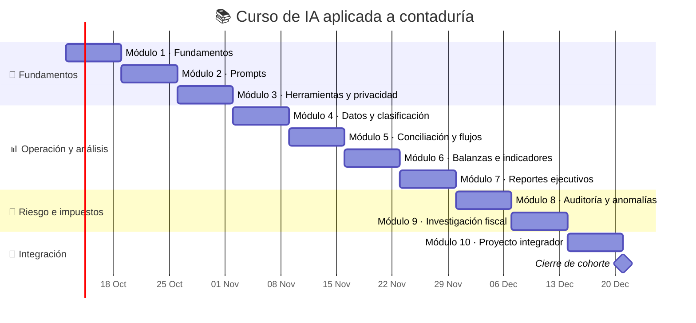

# Plan de trabajo — Curso integral de IA para contaduría

*Propuesta académica de 40 horas, correlacionada con el Laboratorio ContaIA; duración y fecha de inicio adaptables.*

---

## 1. Plan de trabajo del curso completo

### Ficha y supuestos de diseño

| Elemento | Propuesta |
| --- | --- |
| Nombre | Inteligencia artificial aplicada a la práctica contable |
| Duración | 40 horas: 10 semanas de 4 horas |
| Distribución semanal | 3 horas guiadas + 1 hora de práctica independiente |
| Público | Estudiantes y profesionales de contabilidad, auditoría, finanzas e impuestos |
| Prerrequisitos | Manejo básico de hojas de cálculo y criterio contable inicial; no se requiere programar |
| Modalidad | Presencial, remota o híbrida; las herramientas específicas pueden variar |
| Enfoque | Aprendizaje basado en casos ficticios, revisión humana, fuentes comprobables y controles de privacidad |
| Certificación | Es un diseño curricular. En base a matrícula adjunta. |

El programa toma como referencia los temas generales de IA aplicada a contabilidad, automatización, análisis e impuestos que aparecen en las opciones 1, 2 y 6 discutidas previamente. Las actividades de este plan son originales y no sustituyen los materiales o cursos de sus proveedores.[1](#user-content-fn-1)[2](#user-content-fn-2)[3](#user-content-fn-3)

### Resultados de aprendizaje

Al concluir el curso, la persona participante podrá:

1. Explicar para qué tareas contables puede apoyar la IA generativa y reconocer cuándo no hay datos suficientes para usarla.

1. Construir instrucciones que especifiquen rol, contexto, datos permitidos, tarea, formato de salida, límites y verificación.

1. Preparar datos sintéticos o autorizados, seleccionar herramientas de forma responsable y evitar compartir información confidencial.

1. Aplicar IA como apoyo —no como autoridad— para clasificar movimientos, conciliar registros, revisar balanzas y redactar reportes.

1. Formular alertas de análisis financiero sin presentar anomalías como prueba de fraude.

1. Investigar temas fiscales mexicanos con información suficiente, contraste en fuentes oficiales vigentes y revisión profesional, sin inventar tasas ni conclusiones.

1. Diseñar un flujo de trabajo con controles, trazabilidad, revisión humana y criterios para detener o escalar una respuesta.

### Ritmo sugerido de cada semana

Las tres horas guiadas siguen un patrón repetible de 180 minutos: 15 minutos para recuperar conceptos y plantear el caso; 35 para concepto o demostración; 80 para práctica guiada; 40 para revisión entre pares y discusión; y 10 para una salida breve o reflexión. La hora independiente se dedica a terminar el entregable semanal con datos ficticios.

| Semana | Módulo y foco | Trabajo guiado | Evidencia de aprendizaje | Práctica vinculada |
| --- | --- | --- | --- | --- |
| 1 | Fundamentos de IA y criterio profesional | Diferenciar automatización, modelos predictivos e IA generativa; reconocer errores, incertidumbre y necesidad de supervisión. Diagnóstico inicial con un caso simulado. | Mapa de tareas: qué delegar, qué verificar y qué no automatizar. | #1 como diagnóstico de prompt |
| 2 | Diseño de instrucciones contables | Construir prompts con contexto, datos permitidos, tarea, formato, restricciones y verificación; iterar a partir de una rúbrica. | Plantilla de prompt y versión revisada con criterios visibles. | #1 Redacta un prompt contable útil |
| 3 | Herramientas, privacidad y uso seguro | Comparar capacidades según la tarea; reconocer datos personales y confidenciales; anonimizar, validar permisos y definir cuándo no pegar un documento en un asistente. | Matriz de selección de herramienta y lista de control de privacidad. | #9 Nómina: protege datos personales |
| 4 | Preparación de datos y clasificación | Revisar estructura y calidad de archivos; estandarizar campos; proponer categorías; dejar excepciones para revisión humana. | CSV limpio de práctica y mapa de categorías con reglas y excepciones. | #2 Clasifica una compra de oficina |
| 5 | Conciliación y automatización de flujos | Comparar libro y banco; separar coincidencias, diferencias y partidas pendientes; describir un flujo con entradas, reglas, revisión, autorización y registro. | Conciliación explicada y diagrama o procedimiento de flujo con puntos de control. | #3 Encuentra la diferencia bancaria |
| 6 | Balanzas e indicadores financieros | Comprobar sumas; interpretar variaciones; revisar supuestos, periodos y cortes; diferenciar error aritmético de explicación contable. | Hoja de revisión con diferencia, hipótesis permitidas y verificaciones siguientes. | #4 Lee una balanza de comprobación |
| 7 | Reportes y comunicación ejecutiva | Convertir cifras en una explicación breve; separar hechos, hipótesis, limitaciones y recomendación; pedir formato y lenguaje adecuados. | Reporte de una página respaldado por los datos ficticios. | #5 Prepara un reporte ejecutivo breve |
| 8 | Auditoría, excepciones y anomalías | Usar la IA para sugerir patrones a revisar; priorizar señales; requerir evidencia y evitar conclusiones de fraude sin sustento. | Registro de anomalías: señal, evidencia pendiente, riesgo y siguiente paso. | #6 Investiga una anomalía financiera |
| 9 | Investigación fiscal responsable en México | Practicar preguntas con contexto y periodo; distinguir orientación de cálculo o presentación oficial; contrastar requisitos en fuentes actuales del SAT y pedir revisión profesional. | Hoja de verificación de fuentes, datos faltantes y límites de la respuesta. | #7 ISR y #8 RESICO; aplicar también el control de privacidad de #9 |
| 10 | Asistentes, gobernanza y proyecto integrador | Diseñar una especificación reutilizable de asistente o procedimiento; definir entradas, salidas, salvaguardas, métricas y escalamiento; presentar el caso final. | Proyecto integrador y procedimiento operativo breve, sin información real de clientes. | Integración de las nueve prácticas |

### Calendario referencial

*El inicio del 12 de octubre de 2026 se muestra únicamente para visualizar la secuencia; es una fecha de referencia editable, no una fecha confirmada de impartición.*

### Evaluación y criterios de logro

| Componente | Peso | Evidencia |
| --- | --- | --- |
| Portafolio de prácticas del laboratorio | 30 % | Respuestas y reflexiones sobre las nueve actividades con datos ficticios |
| Entregables semanales | 25 % | Prompts, matrices, hojas de revisión, reportes y controles de fuentes |
| Proyecto integrador | 35 % | Flujo de trabajo documentado, ejemplo de salida, verificaciones y decisión humana |
| Uso responsable y trazabilidad | 10 % | Lista de privacidad, límites explícitos, fuentes y registro de incertidumbre |

Se propone un logro global de **80/100** como referencia académica, sujeto a las reglas de la institución que imparta el curso. La revisión de responsabilidad es transversal: el uso de datos reales o confidenciales en un ejercicio no se debe normalizar como atajo de evaluación.

Para calificar los entregables, aplicar una rúbrica común de cuatro dimensiones, cada una de 0 a 3 puntos: (1) precisión respecto a los datos; (2) instrucciones y formato claros; (3) verificación y reconocimiento de límites; y (4) privacidad, trazabilidad y revisión humana. Una respuesta fluida pero no sustentada no recibe el máximo en precisión ni verificación.

### Proyecto integrador

**Caso:** cierre mensual de una microempresa totalmente ficticia, con extracto bancario, libro auxiliar, balanza y variaciones de gasto simuladas.

La persona participante deberá delimitar el problema, preparar los datos, redactar instrucciones, producir una propuesta asistida por una herramienta autorizada, cotejarla con el expediente, señalar incertidumbres, documentar una revisión humana y entregar un resumen ejecutivo con próximos pasos. Si aborda un punto fiscal, deberá citar una fuente oficial vigente y limitarse al análisis educativo: no presentar declaraciones ni calcular obligaciones reales.

### Materiales, preparación y controles

- Reutilizar el [CSV ficticio del repositorio](../../data/transacciones-ficticias.csv) y las nueve prácticas del laboratorio; no cargar archivos de clientes.

- Si el grupo usa una herramienta generativa externa, escogerla según las políticas de la institución y trabajar solo con datos sintéticos o autorizados.

- Mantener una bitácora de prompt, versión de salida, comprobaciones y decisiones humanas; no asumir que una respuesta generada constituye evidencia contable.

- Para preguntas tributarias mexicanas, identificar ejercicio, régimen y datos faltantes; consultar publicaciones vigentes del [sat][4](#user-content-fn-4) y solicitar revisión profesional. El curso no reemplaza asesoría contable, fiscal, laboral o legal.

- Antes de impartirlo, confirmar fechas, tamaño del grupo, herramientas permitidas, modalidad y reglas de evaluación de la entidad responsable.

## 2. Laboratorio interactivo correlacionado

La sección 2 es el [Laboratorio ContaIA en vista previa](https://8328-i143dgisqzurgn5srq8gm-85c68042.us3.manus.computer/), ya construido. Incluye nueve ejercicios en español, corrección local, pistas y soluciones modelo con datos ficticios. No envía las respuestas a un modelo externo ni las conserva al actualizar la página. El laboratorio funciona como espacio de ensayo para el curso, no como sustituto de las sesiones, la discusión profesional o una herramienta de IA autorizada.

| N.º | Práctica existente | Módulo(s) del curso | Aporte al aprendizaje |
| --- | --- | --- | --- |
| 1 | Redacta un prompt contable útil | 1, 2 y 10 | Diagnosticar y mejorar una instrucción con contexto, tarea, formato y verificación |
| 2 | Clasifica una compra de oficina | 4 y 10 | Proponer una clasificación inicial y reconocer qué debe revisar una persona |
| 3 | Encuentra la diferencia bancaria | 5 y 10 | Localizar una partida pendiente y describir un control de conciliación |
| 4 | Lee una balanza de comprobación | 6 y 10 | Interpretar una diferencia aritmética sin inventar un asiento de ajuste |
| 5 | Prepara un reporte ejecutivo breve | 7 y 10 | Separar hechos, comparación, límites y verificaciones siguientes |
| 6 | Investiga una anomalía financiera | 8 y 10 | Tratar un patrón inusual como alerta que requiere evidencia, no como prueba de fraude |
| 7 | ISR: pide evidencia, no una respuesta inventada | 9 y 10 | Detectar datos faltantes y pedir verificación con fuentes vigentes |
| 8 | RESICO: valida antes de orientar | 9 y 10 | Evitar una conclusión de elegibilidad con contexto incompleto |
| 9 | Nómina: protege datos personales | 3, 9 y 10 | Evitar compartir recibos identificables y preferir datos sintéticos/autorizados |

### Secuencia para usar el laboratorio

1. Presentar el objetivo y los criterios del módulo antes de abrir una práctica.

1. Resolver primero sin revelar la solución; pedir una pista solo después de registrar el primer intento.

1. Comparar la respuesta con la retroalimentación y anotar qué dato, fuente o control faltaría en un caso real.

1. Guardar las evidencias de curso en el portafolio institucional, si se requiere; el laboratorio no mantiene el progreso después de actualizar.

1. En módulos fiscales o de nómina, detenerse en la verificación educativa: no usar cifras reales, recibos ni decisiones oficiales.

### Referencias temáticas

La correlación temática usa como referencia las páginas de cursos previamente discutidas; el temario y las prácticas de este repositorio son material original y no implican afiliación, aval ni equivalencia de certificados.[1](#user-content-fn-1)[2](#user-content-fn-2)[3](#user-content-fn-3)

[sat]: https://www.sat.gob.mx/ "Servicio de Administración Tributaria"

## Footnotes

1. Alegra Academy. “Inteligencia Artificial para Contadores”. [https://academy.alegra.com/courses/ia-para-contadores/](https://academy.alegra.com/courses/ia-para-contadores/) [↩](#user-content-fnref-1) [↩2](#user-content-fnref-1-2)

1. Edutin. “Curso de IA para contabilidad”. [https://edutin.com/curso-de-ia-para-contabilidad](https://edutin.com/curso-de-ia-para-contabilidad) [↩](#user-content-fnref-2) [↩2](#user-content-fnref-2-2)

1. ContadorMx. “Inteligencia artificial aplicada a la contabilidad, finanzas e impuestos”. [https://contadormx.net/cursos/inteligencia-artificial-aplicada-a-la-contabilidad-finanzas-e-impuestos/](https://contadormx.net/cursos/inteligencia-artificial-aplicada-a-la-contabilidad-finanzas-e-impuestos/) [↩](#user-content-fnref-3) [↩2](#user-content-fnref-3-2)

1. Servicio de Administración Tributaria (SAT ). Portal institucional; consultar publicaciones vigentes aplicables al ejercicio fiscal de cada caso. [https://www.sat.gob.mx/](https://www.sat.gob.mx/) [↩](#user-content-fnref-4)
